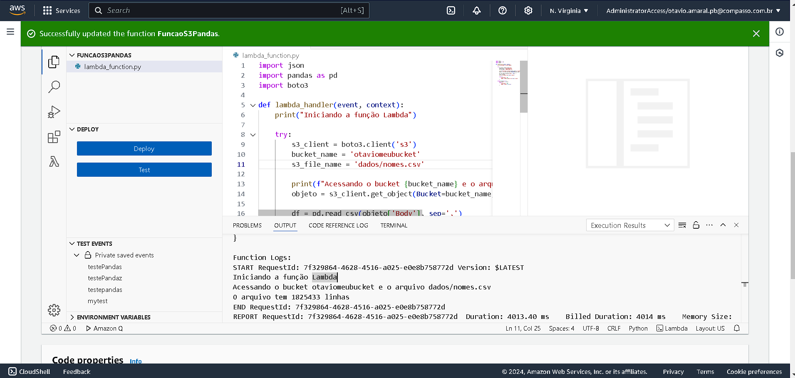
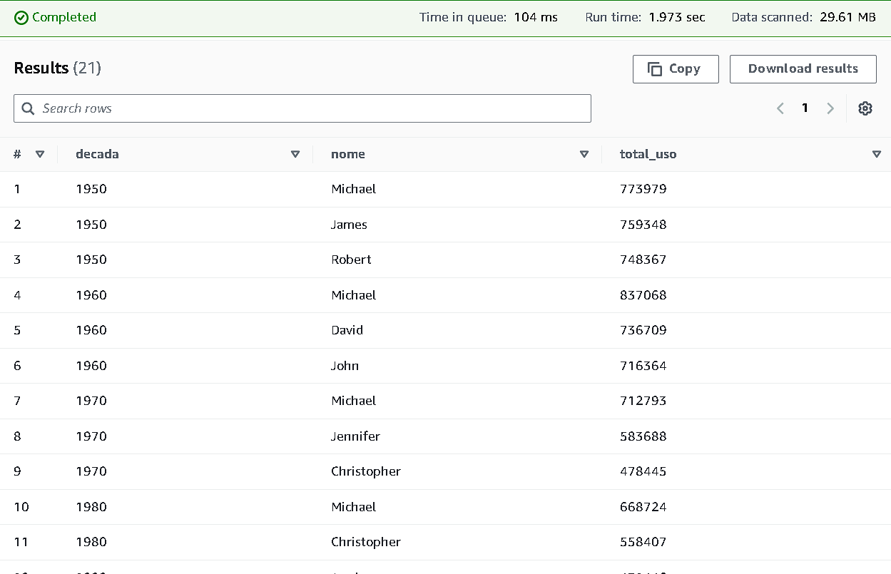

# SPRINT_6
## Data Lake & Análise de Dados com AWS (Sprint + Desafio)

Este projeto integra o desafio principal de construção de um Data Lake utilizando AWS e exercícios de Sprint, abrangendo práticas dos serviços AWS S3, Athena e Lambda, com suporte de camadas (layers) e integrações de dados com Pandas. Foi realizado também um conjunto de cursos da AWS para apoiar no desenvolvimento das atividades.

Realização de cursos da AWS: 
[CURSOS](./certificados/)

1. Data Lake no AWS S3: Criação e configuração de um bucket para armazenar dados estáticos e consultas.

Manipulação de Dados com AWS Athena: Configuração do ambiente de Athena.

2. Automação com AWS Lambda: Criação de uma função Lambda que processa dados no S3, com o suporte de uma camada customizada para incluir bibliotecas como Pandas.

3. Exercício Athena: Criação de banco de dados e tabelas a partir de arquivos CSV no S3, execução de queries SQL.

## Etapas do Desafio
### [desafio](../SPRINT6/desafio/README.MD)