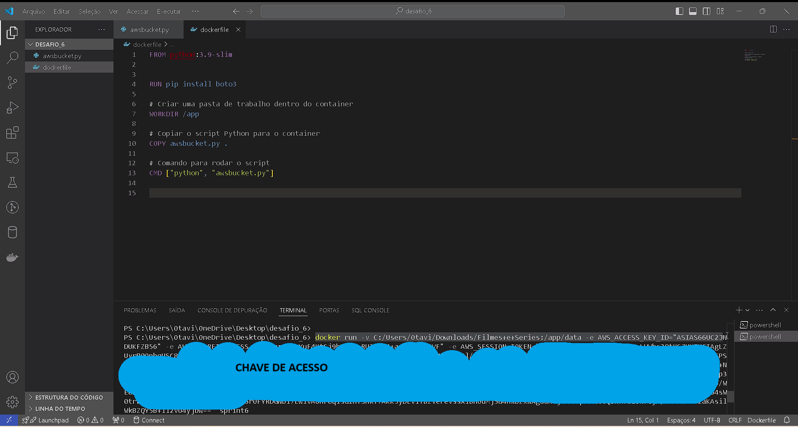

# 🌌 Desafio de Data Lake: Filmes e Séries

## 🚀 Transformando Dados em Conhecimento – Uma Jornada com Filmes e Séries!
1. Objetivo
2. Iniciando a Missão
3. Entrega 1 - Ingestão Batch
4. Evidências & Screenshots
5. Conclusão

### 🎬Ao longo desse desafio, vamos explorar ingestão, armazenamento, processamento e análise de dados. Ao final, seremos capazes de responder perguntas como:

🌟 Nosso foco nesta entrega:
Realizar a ingestão batch de arquivos locais para a AWS S3 em uma estrutura organizada, automatizando o processo com Docker e boto3.

-- Iniciando a Missão
Pré-requisitos:
Baixe o arquivo de dados: Filmes e Series.zip.
Uma conta AWS para manipular o S3.
Desenvolvimento com o uso de Docker e Python.

### 🎬 Explorar o arquivo CSV para definir o tipo de analise...

-- Entrega 1 - Ingestão Batch

Vamos criar um pipeline de ingestão que carrega dados CSV locais para o AWS S3, onde serão organizados com uma estrutura de armazenamento específica.

Estrutura no S3:
Os dados devem ser organizados no bucket conforme o formato:

Modo de Estrutura:

Filmes: S3://data-lake-desafio/RAW/LocalCSV/Movies/YYYYMMDD/movies.csv
Séries: S3://data-lake-desafio/RAW/LocalCSV/Series/YYYYMMDD/series.csv

### 🚧 Passos de Implementação:
1. Implementação do Código Python
Arquivo: awsbucket.py

Este código lê e carrega arquivos CSV no S3, utilizando a biblioteca boto3. Arquivos contendo “movies” ou “series” no nome são direcionados para pastas específicas.

## 📄 awsbucket.py

## [codigo-python](../desafio/awsbucket.py)

## 2. Configuração do Docker
Arquivo: Dockerfile

--Este Dockerfile cria um ambiente para rodar nosso script de upload.

## 📄 Dockerfile
### [DOCKERFILE](../desafio/dockerfile)

3. Construção e Execução do Docker
Construindo a imagem Docker e o container..

## Construir a imagem
docker build -t sprint6 .

# Executar o container criando volume
docker run -v C:/Users/Otavi/Downloads/Filmes+e+Series:/app/data sprint6:

 # Evidências & Screenshots

#### Aqui estão alguns registros da execução do desafio:
### [evidencias](/SPRINT6/evidencias/)

 Conclusão
Essa primeira etapa do desafio foi um exercício de criação de pipelines de dados e uso do Docker para automatização de processos. Neste ponto, a estrutura inicial do Data Lake foi configurada, e os dados foram carregados no S3. Na próxima etapa, exploraremos o processamento e a organização desses dados para análise!

📊 
