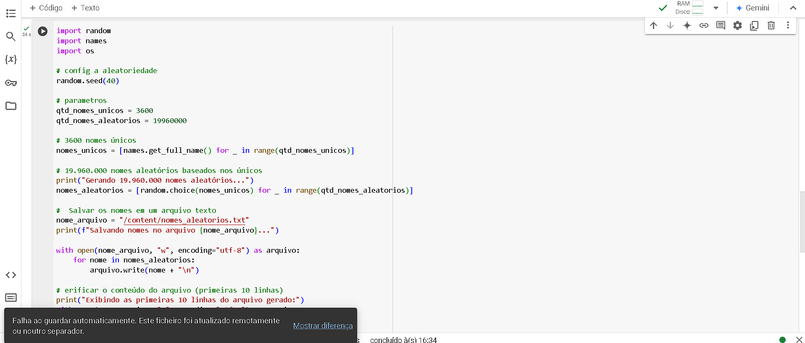
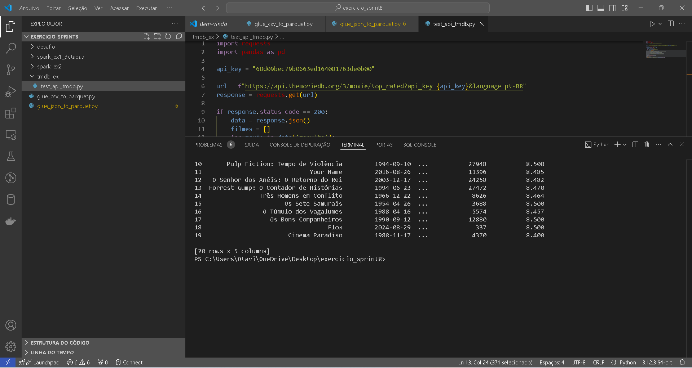
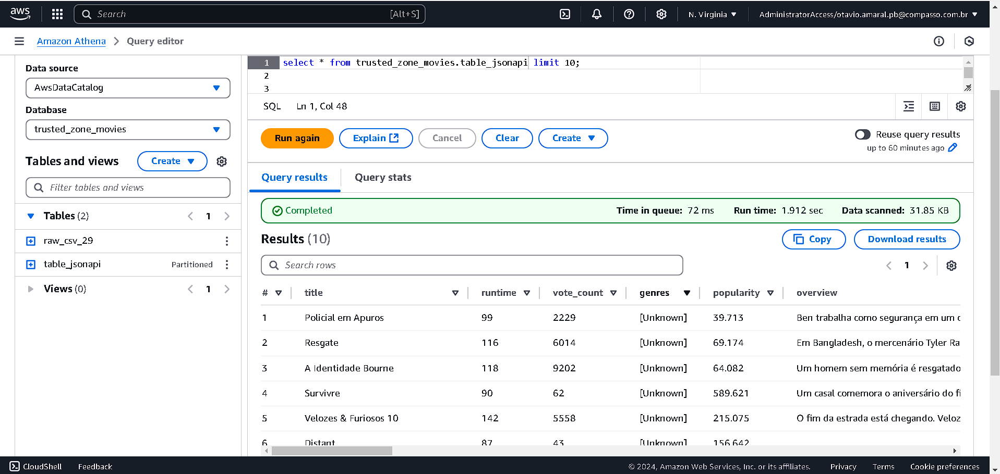

Sprint 8 - Desafio de Filmes e Séries 🛸
1. Objetivo 💻
O principal objetivo desta Sprint foi combinar os conhecimentos adquiridos ao longo do programa, aplicando diferentes habilidades, como manipulação de dados, integração com APIs e utilização de serviços AWS, para resolver o desafio proposto. A Sprint incluiu atividades de processamento de dados, organização de um Data Lake e uso do framework Apache Spark para análises.

2. Entregáveis 📇
🔧 Nesta Sprint, foram entregues os seguintes itens: 🔧

[Códigos Python:](./desafio/glue_csv_to_parquet.py)

[Códigos Python:](./desafio/glue_json_to_parquet.py)

Código para manipulação de dados CSV com o AWS Glue.
Código para manipulação de dados JSON com o AWS Glue.
[Markdown:](./desafio/markdown.md)

Documentação explicativa com evidências (prints e imagens) e explicação detalhada das etapas do desafio.
Evidências: [Evidências](./evidencias/)

Prints dos resultados obtidos durante as atividades de processamento.
Logs das execuções realizadas para comprovação.
3. Detalhamento das Etapas Realizadas
--3.1 Preparação do Ambiente
    Foi realizada a configuração inicial do ambiente, incluindo:

Instalação de bibliotecas necessárias, como pyspark, names, e random.
Criação de diretórios locais e organização dos arquivos do projeto.
Foi gerado um arquivo de texto contendo uma lista de 20 nomes de animais em ordem crescente, armazenados no formato CSV.

Implementado um script para geração de um dataset com nomes aleatórios, conforme descrito nos passos:

Configuração de semente de aleatoriedade com random.seed.
Geração de 3.600 nomes únicos e 19.960.000 nomes aleatórios, utilizando a biblioteca names.
Exportação dos dados gerados para o arquivo nomes_aleatorios.txt.

--3.2 Processamento com Apache Spark 🎲 🎲
    Criação e Configuração do DataFrame:

Foi realizado o carregamento do arquivo nomes_aleatorios.txt em um DataFrame Spark.
O schema foi ajustado para exibir as colunas no formato esperado.
Transformações no DataFrame:

Inclusão das colunas:
Escolaridade: Valores aleatórios entre Fundamental, Médio e Superior.
País: Distribuição aleatória entre os 13 países da América do Sul.
Ano de Nascimento: Valores aleatórios entre 1945 e 2010.
Análises Realizadas:

Seleção de pessoas nascidas neste século (após o ano 2000).
Contagem do número de pessoas da geração Millennials (1980 a 1994) utilizando:
Método filter do DataFrame.
Comando SQL no Spark.
Contagem de pessoas por país e por geração (Baby Boomers, Geração X, Millennials, Geração Z).

--3.3 Integração com a API TMDB
    Criação da Conta e Configuração da API:

Conta criada no TMDB para obtenção da chave de API.
Testes realizados para validar o funcionamento das credenciais e o retorno da API.
Extração de Dados:

Código desenvolvido para consumir dados da API TMDB, recuperando informações de filmes, como:
Título
Data de lançamento
Média de votos
Visão geral.

4. Processamento na AWS (Camada Trusted)
--4.1 Organização do Data Lake
    Camada Raw Zone:

Dados CSV e JSON foram organizados na camada Raw.

Camada Trusted Zone:
Os dados foram limpos e transformados utilizando o AWS Glue:
Arquivos CSV: Processados e armazenados no formato Parquet.
Arquivos JSON: Convertidos para Parquet e particionados por data.
Integração com Glue Data Catalog e Athena:

A camada Trusted foi registrada no Glue Data Catalog, permitindo consultas via Athena.
Testes foram realizados para validar a acessibilidade e consistência dos dados.
5. Código e Motivadores
Motivadores para o uso de APIs:

A API TMDB foi escolhida por sua rica base de dados de filmes e séries, possibilitando análises relevantes.
O uso de APIs REST permite acessar dados atualizados e integrar informações de diferentes fontes de forma eficiente.
Códigos Desenvolvidos:

Código Python para manipulação de CSV (AWS Glue)
Código Python para manipulação de JSON (AWS Glue)
6. Questões Respondidas
Quais são as características mais comuns dos filmes mais votados?
Existe relação entre o tempo de duração e a média de votos?
Como a popularidade dos filmes muda ao longo das gerações?
7. Prints e Evidências

8. Considerações Finais
As atividades realizadas na Sprint 8 consolidaram os conhecimentos sobre manipulação de dados, integração com APIs e uso de serviços AWS.
Foi possível criar um fluxo completo, desde a coleta e processamento até a análise dos dados na Trusted Zone.