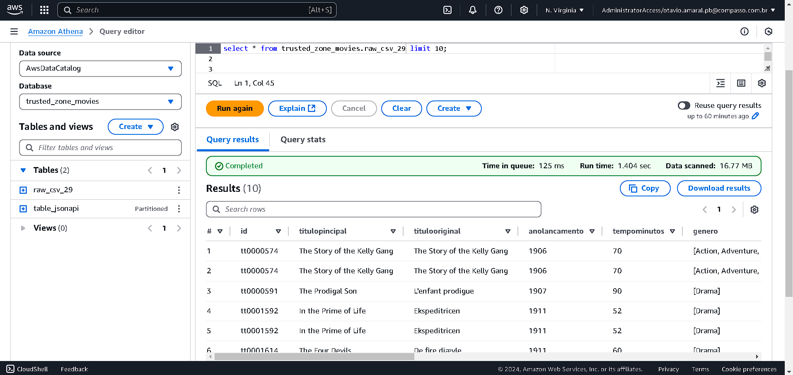
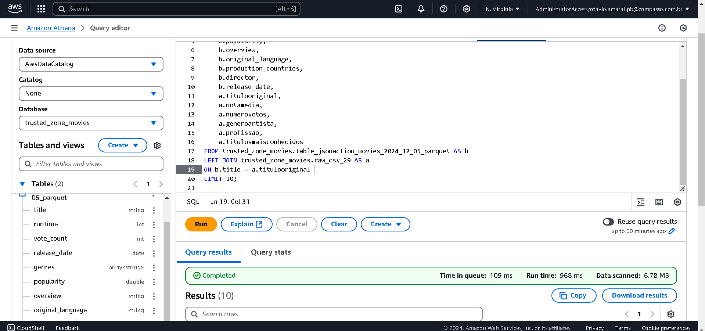

## Desafio de Processamento de Dados - Camada Trusted
####  Objetivo
O objetivo deste desafio é aplicar os conhecimentos adquiridos ao longo do programa para realizar o processamento de dados, movendo-os da camada Raw Zone para a Trusted Zone de um data lake. Utilizaremos o AWS Glue e o Apache Spark para garantir que os dados estejam limpos, padronizados e prontos para consultas no AWS Athena.

####  Desafio - 
O que é a Camada Trusted?
A camada Trusted nesse data lake é aquela onde os dados já foram tratados, limpos e estão prontos para análise. Esses dados são extraídos da camada Raw Zone, que contém os dados brutos. O desafio consiste em mover os dados da Raw Zone para a Trusted Zone, realizando o processamento e transformação necessários para garantir que os dados sejam consistentes e prontos para consulta no AWS Athena.

##### Objetivo dessa Etapa
Usar o AWS Glue e o Apache Spark para processar dados e transformá-los no formato Parquet, adequado para consultas no AWS Athena.
Armazenar os dados processados na Trusted Zone no S3, registrando-os no Glue Data Catalog.
A transformação de dados deve garantir que a camada Trusted contenha dados limpos e padronizados, com o formato correto.

## Passos do Processo
1. Leitura e Processamento dos Dados

-- O processo envolve duas fontes principais de dados:

Arquivos CSV: Estes arquivos estão na Raw Zone e devem ser lidos, tratados e convertidos para o formato Parquet.

Dados JSON da API TMDB: Os dados provenientes da API TMDB precisam ser processados e transformados para o formato Parquet, mas precisam ser particionados por data.

2. Transformação e Padronização
Arquivos CSV: Esses dados precisam ser limpos e convertidos para o formato Parquet. Não será necessário particioná-los, mas a transformação deve garantir a qualidade dos dados.
Dados TMDB (JSON): Para os dados da API TMDB, eles devem ser particionados por data de criação (ano, mês, dia) seguindo o padrão WWW.

3. Armazenamento na Trusted Zone
Após o processamento, os dados serão armazenados na Trusted Zone no formato Parquet. Os dados TMDB serão particionados por data de criação. Todos os dados serão armazenados no S3 e registrados no Glue Data Catalog, permitindo a análise posterior via AWS Athena.

4. Validação e Consultas no AWS Athena
Após o processamento dos dados, será possível realizar consultas SQL no AWS Athena para validar a integridade dos dados e garantir que a transformação foi bem-sucedida. Por exemplo, verificar a distribuição dos filmes, analisar a duração média ou verificar se todos os registros foram processados corretamente.

## Passo a Passo Detalhado

### Passo 1: Preparação do Ambiente
Configuração do AWS Glue;
Buckets S3: Verifiquei os arquivos da Raw Zone see realmente estavam dispostos nesse caminho no buckets S3:
s3://otaviodesafio/Raw/TMDB/JSON/ e s3://otaviodesafio/Raw/LocalCSV/Movies/.

Permissões: Garanti que tinha permissões necessárias para ler e escrever nos buckets S3, além de permissão para criar e executar jobs no AWS Glue.

### Passo 2: Criação dos Jobs no AWS Glue
Job 1 - Processamento de CSV:

Este job é responsável por ler os dados CSV;

[Job_CSV](glue_csv_to_parquet.py)

Job 2 - Processamento de Dados TMDB (JSON):

[Job_JSON](glue_json_to_parquet.py)

O segundo job será responsável pelo processamento dos dados provenientes da API TMDB.
Os dados devem ser particionados por data de criação (ano, mês, dia) para que possam ser consultados de forma eficiente posteriormente.

### Passo 3: Execução dos Jobs no AWS Glue
Executando os dois jobs no AWS Glue para processar os dados e garantir que eles sejam carregados na Trusted Zone corretamente.
Importante: Após a execução dos jobs, precisamos interrompê-los para evitar custos desnecessários.

### Passo 4: Validação e Consultas no AWS Athena
Após o processamento dos dados, utilize o AWS Athena para realizar algumas consultas SQL e garantir que os dados estejam bem estruturados e prontos para análise: 

4. Considerações Finais
Custo e Desempenho: Sempre monitoro o desempenho dos jobs e o custo de execução no AWS Glue. Para evitar custos extras, eu interrompo os jobs quando não estão em uso.

Validação: Após a execução, uso o AWS Athena para validar se a transformação e o carregamento dos dados foram feitos corretamente. As consultas que realizo confirmam se os dados estão prontos para análise.

Com a conclusão dessa etapa, os dados ficam limpos e estruturados de forma adequada, prontos para serem analisados e utilizados em modelos de dados avançados.