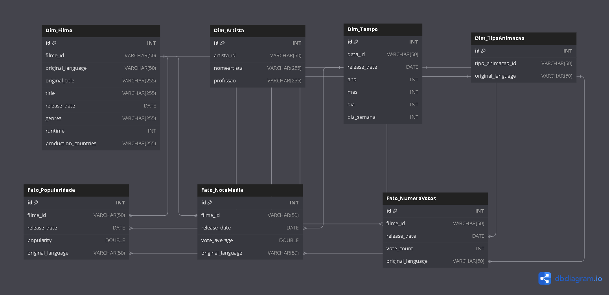

README da Sprint 9 - (Filmes: anime de ação)

1. Visão Geral

A Sprint 9 teve como objetivo consolidar e aplicar os conhecimentos adquiridos ao longo do programa por meio da modelagem e processamento de dados para a camada Refined de um data lake. Este processo envolveu desde a organização e transformação de dados da Trusted Zone até a preparação para análises avançadas e visualizações.

Nesta etapa do Desafio de Filmes e Séries, focamos na entrega 4, que englobou a criação de tabelas seguindo princípios de modelagem multidimensional e o desenvolvimento de jobs no AWS Glue para armazenar os dados na camada Refined em formato Parquet. O trabalho realizado garantiu que os dados estivessem prontos para visualizações no QuickSight, programadas para a Sprint seguinte.

2. Objetivos da Sprint

Modelagem de Dados para a Camada Refined: Estruturar os dados oriundos da Trusted Zone para atender às necessidades de análise e consulta multidimensional.

Transformação e Processamento: Aplicar o Apache Spark para transformar os dados, persistindo-os na Refined Zone em formato Parquet.

Criação de Tabelas e Views no Glue Data Catalog: Garantir a organização e acessibilidade dos dados refinados para ferramentas de visualização e análise.

3. Atividades Realizadas

3.1. Modelagem de Dados

Utilizamos os princípios de modelagem dimensional para criar um modelo que suportasse consultas analíticas sobre diferentes perspectivas dos dados. O modelo incluiu tabelas fato e dimensões, organizadas para atender aos casos de uso do desafio.

3.2. Processamento com AWS Glue

Desenvolvemos jobs no AWS Glue para transformar os dados da camada Trusted, estruturando-os de acordo com o modelo definido. Algumas características dos jobs:

Uso do Apache Spark como engine de processamento.

Persistência dos dados no formato Parquet, com particionamento estratégico para melhorar o desempenho de consultas.

Configuração de workers tipo G 1x (2 workers) e timeout de até 60 minutos, garantindo eficiência e custo-benefício.

Os scripts foram desenvolvidos no formato .py, com organização clara.
3.3. Criação de Tabelas no Glue Data Catalog

Todas as tabelas criadas foram registradas no AWS Glue Data Catalog. Isso assegurou a descoberta e acessibilidade dos dados refinados para futuras consultas e integração com o QuickSight.

4. Entregáveis

Código-Fonte: Arquivo Python contendo o código do AWS Glue desenvolvido para a camada Refined.

Modelo de Dados: Diagrama da modelagem multidimensional da camada Refined.

Evidências: Prints das execuções bem-sucedidas dos jobs e exemplos de consultas realizadas nos dados refinados.

Documentação: Este README, esta resumindo o conteudo da Sprint, decisões tomadas e resultados alcançados.
Detalhes da realização do desafio: [Desafio](./desafio/README.MD)

5. Aprendizados e Desafios

A Sprint 9 foi uma oportunidade de consolidar habilidades em modelagem de dados, processamento em larga escala com Spark e uso de serviços AWS como Glue e S3. Entre os principais aprendizados, destacam-se:

A importância de uma modelagem bem planejada para consultas eficientes.

O impacto do particionamento de dados no desempenho de análises.

A necessidade de ajustar configurações de jobs para equilibrar custo e desempenho.

Entre os desafios enfrentados, podemos citar:

Ajustar os scripts para lidar com inconsistências nos dados da Trusted Zone.

Garantir que os jobs rodassem dentro do limite de timeout, otimizando as transformações.

6. Conclusão

Com a conclusão da Sprint 9, os dados estão prontos para análise e visualização, marcando um avanço significativo no Desafio de Filmes e Séries. A camada Refined foi estruturada de forma robusta e escalável, atendendo aos objetivos propostos e estabelecendo a base para as próximas etapas do desafio.

Os artefatos entregues, incluindo código, modelo de dados e documentação, refletem o comprometimento e o aprendizado contínuo ao longo do programa. Estamos prontos para avançar para a Sprint 10 e explorar as possibilidades de visualização e análise com o QuickSight.

